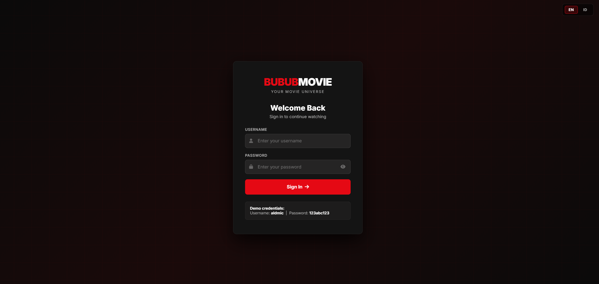

# 🎬 Bubub Movie

Platform streaming film bergaya Netflix yang dibangun dengan Laravel 11 dan API OMDb API.

---

## ✨ Fitur Utama

- 🔐 **Autentikasi** — Login dengan kredensial tetap (`aldmic` / `123abc123`)
- 🎥 **Daftar Film** — Browse film dengan kategori (Trending, Action, Drama, Comedy)
- 🔍 **Pencarian & Filter** — Cari berdasarkan judul, tipe (movie/series), dan tahun
- ♾️ **Infinite Scroll** — Hasil pencarian dimuat otomatis saat scroll ke bawah
- 💤 **Lazy Load** — Gambar poster dimuat secara lazy untuk performa optimal
- ❤️ **Favorite Movie** — Tambah/hapus film dari daftar favorit (disimpan di NeonDB)
- 🌐 **Multi Language** — Dukungan bahasa Inggris (EN) dan Indonesia (ID)
- 📱 **Responsif** — Desain adaptif untuk mobile dan desktop
- 🎨 **Netflix UI** — Desain gelap premium terinspirasi Netflix

---

## 🛠️ Tech Stack

| Kategori | Library/Tool |
|---|---|
| Framework | Laravel 11 |
| Database | NeonDB (PostgreSQL serverless) |
| HTTP Client | GuzzleHTTP 7 |
| Movie API | OMDb API |
| Frontend | Vanilla JS + CSS Custom Properties |
| Icons | Font Awesome 6 |
| Font | Inter (Google Fonts) |
| Lazy Load | Intersection Observer API |
| Infinite Scroll | Intersection Observer API |

---

## 🏗️ Arsitektur

```
app/
├── Http/
│   ├── Controllers/
│   │   ├── AuthController.php     # Login/Logout
│   │   ├── MovieController.php    # Browse, Search, Detail
│   │   └── FavoriteController.php # CRUD Favorites
│   └── Middleware/
│       └── SetLocale.php          # Multi-language middleware
├── Models/
│   ├── User.php
│   └── Favorite.php
├── Services/
│   └── OmdbService.php            # OMDb API wrapper dengan caching
└── Providers/
    └── AppServiceProvider.php

resources/
├── views/
│   ├── layouts/app.blade.php      # Main layout dengan navbar
│   ├── auth/login.blade.php       # Halaman login
│   ├── movies/
│   │   ├── index.blade.php        # Halaman daftar + hero + categories
│   │   └── show.blade.php         # Halaman detail film
│   ├── favorites/index.blade.php  # Halaman daftar favorit
│   └── components/movie-card.blade.php
└── lang/
    ├── en/                        # Bahasa Inggris
    └── id/                        # Bahasa Indonesia
```

**Pattern yang digunakan:**
- **MVC** (Model-View-Controller) — Laravel standar
- **Service Layer** — `OmdbService` memisahkan logika API dari controller
- **Repository-style** — Eloquent models sebagai data access layer
- **Lazy Loading** — IntersectionObserver untuk gambar
- **Optimistic UI** — Instant feedback pada tombol favorit

---

## 🚀 Instalasi & Menjalankan

### Prasyarat
- PHP 8.2+
- Composer
- PostgreSQL / NeonDB account

### Langkah Instalasi

```bash
# 1. Clone / extract project
cd bubub-movie

# 2. Install dependencies
composer install

# 3. Copy environment file
cp .env.example .env

# 4. Generate app key
php artisan key:generate

# 5. Konfigurasi .env (database NeonDB + OMDB API key)
# Edit DB_HOST, DB_DATABASE, DB_USERNAME, DB_PASSWORD, OMDB_API_KEY

# 6. Jalankan migrasi
php artisan migrate

# 7. Jalankan server
php artisan serve
```

Aplikasi berjalan di: http://localhost:8000

---

## 🔑 Kredensial Login

| Field | Value |
|---|---|
| Username | aldmic |
| Password | 123abc123 |

---

## 📸 Screenshot



---

.png>)

---

### Halaman Login
- Form login bergaya Netflix dengan background grid merah
- Toggle show/hide password
- Demo credentials ditampilkan di bawah form

### Halaman Utama (Daftar Film)
- Hero banner dengan film featured
- Baris kategori: Trending, Action, Drama, Comedy
- Search bar dengan filter tipe dan tahun
- Tombol favorit muncul saat hover kartu film

### Halaman Detail Film
- Backdrop blur dari poster
- Info lengkap: rating, genre, cast, director, dll
- Tombol tambah/hapus favorit
- Section "More Like This"

### Halaman Favorit
- Grid semua film favorit
- Hapus favorit dengan konfirmasi
- Empty state jika belum ada favorit

---

## 🌐 Multi Language

Ganti bahasa dengan mengklik tombol **EN** / **ID** di pojok kanan navbar atau halaman login.

Bahasa yang didukung:
- 🇬🇧 English (default)
- 🇮🇩 Bahasa Indonesia

---

## 📡 OMDb API Integration

- **Search**: `GET /?s={query}&page={page}&type={type}&y={year}`
- **Detail**: `GET /?i={imdbID}&plot=full`
- Response di-cache selama 5 menit (search) dan 1 jam (detail) menggunakan in-memory cache

---

## 🔒 Keamanan

- CSRF protection pada semua form dan AJAX request
- Auth middleware melindungi semua route kecuali login
- Password di-hash menggunakan bcrypt
- SQL injection dicegah dengan Eloquent ORM + parameter binding
- XSS dicegah dengan Blade template escaping

---

## 📄 Lisensi

MIT License — Dibuat untuk keperluan technical test.
