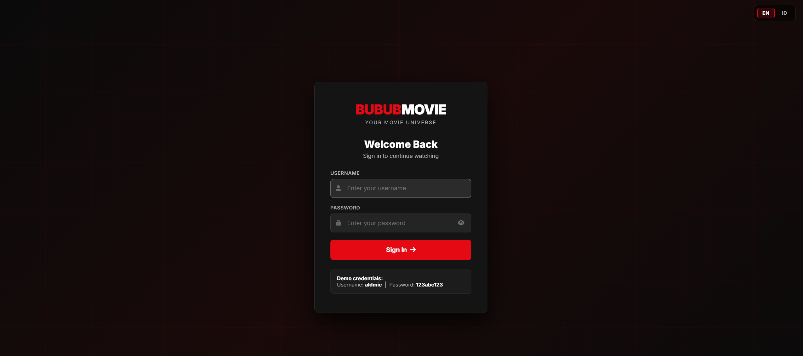
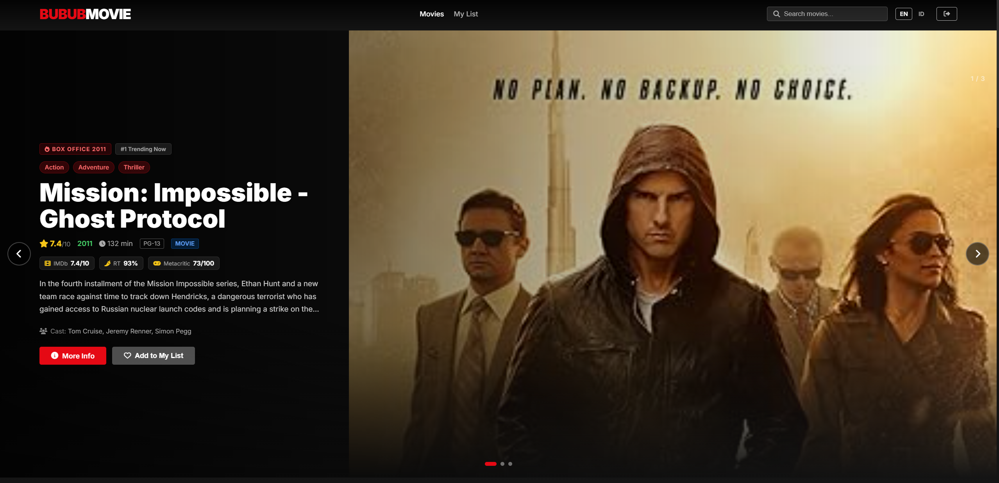

# 🎬 BUBUBMOVIE

> Platform list film ini dibangun dengan **Laravel 11** dan consume API dari **OMDb API**.



---



---

## 📋 Daftar Isi

- [🎬 BUBUBMOVIE](#-bububmovie)
  - [📋 Daftar Isi](#-daftar-isi)
  - [Overview](#overview)
  - [Fitur Utama](#fitur-utama)
  - [Tech Stack](#tech-stack)
  - [Arsitektur Proyek](#arsitektur-proyek)
  - [Prasyarat](#prasyarat)
  - [Instalasi](#instalasi)
    - [1. Clone / Extract Project](#1-clone--extract-project)
    - [2. Install Dependencies PHP](#2-install-dependencies-php)
    - [3. Setup Environment File](#3-setup-environment-file)
    - [4. Jalankan Migrasi Database](#4-jalankan-migrasi-database)
    - [5. Jalankan Development Server](#5-jalankan-development-server)
  - [Konfigurasi Environment (.env)](#konfigurasi-environment-env)
    - [Aplikasi](#aplikasi)
    - [Database](#database)
    - [OMDb API](#omdb-api)
    - [Cache, Queue \& Session](#cache-queue--session)
    - [Mail \& Logging](#mail--logging)
    - [Contoh File `.env` Lengkap](#contoh-file-env-lengkap)
  - [Kredensial Login Demo](#kredensial-login-demo)
  - [Daftar Route](#daftar-route)
  - [Integrasi OMDb API](#integrasi-omdb-api)
  - [Keamanan](#keamanan)
  - [Lisensi](#lisensi)

---

## Overview

Bubub Movie adalah platform streaming film bergaya Netflix yang mendukung pencarian film, favorit, multi-bahasa, infinite scroll, dan tampilan responsif premium. Data film diambil secara real-time dari OMDb API dan favorit disimpan di NeonDB (PostgreSQL serverless).

---

## Fitur Utama

- 🔐 **Autentikasi** — Login dengan kredensial tetap (`aldmic` / `123abc123`)
- 🎠 **Hero Carousel** — Banner film box office dengan auto-play 6 detik, navigasi panah, dots, dan swipe mobile
- 🎥 **Kategori Film** — Baris Trending, Action, Drama, Comedy dengan skeleton loading
- 🔍 **Pencarian & Filter** — Cari berdasarkan judul, tipe (movie/series), dan tahun rilis
- 💬 **Autocomplete** — Dropdown sugesti real-time (min. 2 karakter, debounce 300ms) — tersedia di navbar atas dan search bar bawah
- ♾️ **Infinite Scroll** — Hasil pencarian & "More Like This" dimuat otomatis saat scroll ke bawah
- 💤 **Lazy Load** — Poster film hanya di-fetch saat masuk ke viewport
- ❤️ **Favorit** — Tambah/hapus film dari daftar favorit, disimpan di NeonDB
- 🌐 **Multi Language** — Bahasa Inggris (EN) dan Indonesia (ID), ganti via navbar
- 📱 **Responsif** — Desain adaptif untuk mobile dan desktop
- 🎨 **Netflix UI** — Tampilan gelap premium dengan animasi shimmer skeleton loading

---

## Tech Stack

| Kategori | Library / Tool | Keterangan |
|---|---|---|
| Framework | Laravel 11 | PHP framework utama |
| Database | NeonDB (PostgreSQL serverless) | Menyimpan data favorit user |
| HTTP Client | GuzzleHTTP 7 | Request ke OMDb API |
| Movie API | OMDb API | Sumber data film |
| Frontend | Vanilla JS + CSS Custom Properties | Tanpa framework JS eksternal |
| Icons | Font Awesome 6.5 | Icon set |
| Font | Inter (Google Fonts) | Tipografi |
| Lazy Load | IntersectionObserver API | Native browser API |
| Infinite Scroll | Scroll Event + Polling | Reliable cross-browser |
| Session | Cookie-based | Lifetime 120 menit |
| Cache | Array (in-memory) | Search 5 mnt, detail 1 jam |

---

## Arsitektur Proyek

```
app/
├── Http/
│   ├── Controllers/
│   │   ├── AuthController.php          # Login & Logout
│   │   ├── MovieController.php         # Browse, Search, Detail, Autocomplete, DetailJson
│   │   └── FavoriteController.php      # CRUD Favorites
│   └── Middleware/
│       └── SetLocale.php               # Multi-language middleware
├── Models/
│   ├── User.php
│   └── Favorite.php
└── Services/
    └── OmdbService.php                 # OMDb API wrapper dengan caching

resources/
├── views/
│   ├── layouts/
│   │   └── app.blade.php               # Main layout — navbar, toast, lazy observer, autocomplete navbar
│   ├── auth/
│   │   └── login.blade.php             # Halaman login
│   ├── movies/
│   │   ├── index.blade.php             # Halaman utama — hero carousel, kategori, search
│   │   └── show.blade.php              # Halaman detail film + More Like This (infinite scroll)
│   ├── favorites/
│   │   └── index.blade.php             # Halaman daftar favorit
│   └── components/
│       └── movie-card.blade.php        # Komponen card film reusable
└── lang/
    ├── en/                             # Terjemahan Bahasa Inggris
    └── id/                             # Terjemahan Bahasa Indonesia

routes/
└── web.php                             # Semua route (auth + protected)
```

---

## Prasyarat

| Kebutuhan | Versi Minimum | Keterangan |
|---|---|---|
| PHP | 8.2+ | Ekstensi: `pdo_pgsql`, `openssl`, `mbstring`, `tokenizer`, `xml`, `ctype`, `json` |
| Composer | 2.x | Dependency manager PHP |
| PostgreSQL / NeonDB | — | Bisa pakai [NeonDB gratis](https://neon.tech) atau PostgreSQL lokal |
| OMDb API Key | — | Daftar gratis di [omdbapi.com/apikey.aspx](https://www.omdbapi.com/apikey.aspx) — limit 1.000 req/hari |

---

## Instalasi

### 1. Clone / Extract Project

```bash
cd bubub-movie
```

### 2. Install Dependencies PHP

```bash
composer install
```

### 3. Setup Environment File

```bash
cp .env.example .env
php artisan key:generate
```

> Edit file `.env` sesuai konfigurasi di [bagian berikut](#konfigurasi-environment-env).

### 4. Jalankan Migrasi Database

```bash
php artisan migrate
```

### 5. Jalankan Development Server

```bash
php artisan serve
```

Aplikasi berjalan di: **http://localhost:8000**

---

## Konfigurasi Environment (.env)

### Aplikasi

| Variable | Nilai Default | Keterangan |
|---|---|---|
| `APP_NAME` | `"Bubub Movie"` | Nama aplikasi |
| `APP_ENV` | `local` | Environment: `local` \| `production` \| `staging` |
| `APP_KEY` | `base64:xxx...` | Kunci enkripsi — **wajib** diisi via `php artisan key:generate` |
| `APP_DEBUG` | `true` | `true` = tampilkan error detail. Ganti `false` di production |
| `APP_URL` | `http://localhost:8000` | URL dasar aplikasi. Sesuaikan jika deploy ke server |
| `APP_LOCALE` | `en` | Bahasa default: `en` atau `id` |
| `APP_FALLBACK_LOCALE` | `en` | Bahasa fallback jika terjemahan tidak ditemukan |

### Database

| Variable | Nilai Contoh | Keterangan |
|---|---|---|
| `DB_CONNECTION` | `pgsql` | Driver database — **jangan ubah ke mysql** |
| `DB_HOST` | `ep-xxx.aws.neon.tech` | Host NeonDB (dari dashboard) atau `localhost` jika lokal |
| `DB_PORT` | `5432` | Port PostgreSQL standar |
| `DB_DATABASE` | `neondb` | Nama database |
| `DB_USERNAME` | `neondb_owner` | Username database |
| `DB_PASSWORD` | `npg_xxxxxx` | Password database — **jangan commit ke git** |
| `DB_SSLMODE` | `require` | **Wajib `require`** untuk NeonDB. Ubah ke `prefer` jika PostgreSQL lokal |

> **Cara mendapatkan kredensial NeonDB:** Login ke [neon.tech](https://neon.tech) → pilih project → **Connection Details** → copy masing-masing field.

### OMDb API

| Variable | Nilai Contoh | Keterangan |
|---|---|---|
| `OMDB_API_KEY` | `ec7c3b26` | API key dari OMDb. Limit gratis: 1.000 request/hari |

> **Cara mendapatkan API key:** Daftar di [omdbapi.com/apikey.aspx](https://www.omdbapi.com/apikey.aspx) → pilih FREE tier → cek email untuk aktivasi.

### Cache, Queue & Session

| Variable | Nilai Default | Keterangan |
|---|---|---|
| `CACHE_STORE` | `array` | In-memory cache. Ganti ke `redis` untuk production agar persisten antar-request |
| `QUEUE_CONNECTION` | `sync` | Queue sinkron — tidak butuh worker terpisah |
| `SESSION_DRIVER` | `cookie` | Session disimpan di cookie browser |
| `SESSION_LIFETIME` | `120` | Durasi session dalam menit (120 = 2 jam) |

### Mail & Logging

| Variable | Nilai Default | Keterangan |
|---|---|---|
| `LOG_CHANNEL` | `stack` | Channel logging Laravel |
| `LOG_LEVEL` | `debug` | Level log: `debug` \| `info` \| `warning` \| `error` |
| `MAIL_MAILER` | `log` | Email ditulis ke log (tidak terkirim). Ganti ke `smtp` di production |
| `MAIL_FROM_ADDRESS` | `hello@bububbmovie.com` | Alamat pengirim email |
| `MAIL_FROM_NAME` | `${APP_NAME}` | Nama pengirim (otomatis dari `APP_NAME`) |

### Contoh File `.env` Lengkap

```env
APP_NAME="Bubub Movie"
APP_ENV=local
APP_KEY=base64:ISI_DENGAN_php_artisan_key:generate
APP_DEBUG=true
APP_URL=http://localhost:8000
APP_LOCALE=en
APP_FALLBACK_LOCALE=en

LOG_CHANNEL=stack
LOG_DEPRECATIONS_CHANNEL=null
LOG_LEVEL=debug

# ─── Database (NeonDB / PostgreSQL) ────────────────────────────
DB_CONNECTION=pgsql
DB_HOST=ep-lingering-darkness-a19mgj2b-pooler.ap-southeast-1.aws.neon.tech
DB_PORT=5432
DB_DATABASE=neondb
DB_USERNAME=neondb_owner
DB_PASSWORD=GANTI_DENGAN_PASSWORD_ANDA
DB_SSLMODE=require

# ─── OMDb API ───────────────────────────────────────────────────
OMDB_API_KEY=GANTI_DENGAN_API_KEY_ANDA

# ─── Cache, Queue, Session ──────────────────────────────────────
BROADCAST_DRIVER=log
CACHE_STORE=array
FILESYSTEM_DISK=local
QUEUE_CONNECTION=sync
SESSION_DRIVER=cookie
SESSION_LIFETIME=120

# ─── Mail ───────────────────────────────────────────────────────
MAIL_MAILER=log
MAIL_FROM_ADDRESS="hello@bububbmovie.com"
MAIL_FROM_NAME="${APP_NAME}"
```

---

## Kredensial Login Demo

| Field | Value |
|---|---|
| Username | `aldmic` |
| Password | `123abc123` |

---

## Daftar Route

| Method | URL | Controller | Middleware | Keterangan |
|---|---|---|---|---|
| `GET` | `/login` | `AuthController@showLogin` | guest | Halaman login |
| `POST` | `/login` | `AuthController@login` | guest | Proses login |
| `POST` | `/logout` | `AuthController@logout` | auth | Logout |
| `GET` | `/lang/{locale}` | — | — | Ganti bahasa (`en`/`id`) |
| `GET` | `/` | `MovieController@index` | auth | Halaman utama |
| `GET` | `/movies` | `MovieController@index` | auth | Alias halaman utama |
| `GET` | `/movies/search` | `MovieController@search` | auth | Search & filter film (JSON) |
| `GET` | `/movies/autocomplete` | `MovieController@autocomplete` | auth | Sugesti autocomplete (JSON) |
| `GET` | `/movies/detail-json` | `MovieController@detailJson` | auth | Detail film untuk hero carousel (JSON) |
| `GET` | `/movies/{imdbID}` | `MovieController@show` | auth | Halaman detail film |
| `GET` | `/favorites` | `FavoriteController@index` | auth | Daftar favorit |
| `POST` | `/favorites` | `FavoriteController@store` | auth | Tambah favorit |
| `DELETE` | `/favorites/{imdbID}` | `FavoriteController@destroy` | auth | Hapus favorit |
| `GET` | `/favorites/check/{imdbID}` | `FavoriteController@check` | auth | Cek status favorit |

---

## Integrasi OMDb API

Base URL: `https://www.omdbapi.com/`

| Endpoint Internal | Parameter OMDb | Fungsi |
|---|---|---|
| `GET /movies/search` | `s={query}&page={n}&type={type}&y={year}` | Cari film, filter opsional |
| `GET /movies/autocomplete` | `s={query}&page=1` | Ambil 6 sugesti judul (min. 2 karakter) |
| `GET /movies/detail-json` | `i={imdbID}&plot=full` | Detail film untuk hero carousel |
| `GET /movies/{imdbID}` | `i={imdbID}&plot=full` | Detail film halaman show |

**Cache:** search → 5 menit | detail film → 1 jam (in-memory array)

---

## Keamanan

- **CSRF protection** — semua form dan AJAX request menyertakan token CSRF
- **Auth middleware** — semua route kecuali `/login` dilindungi middleware auth
- **Password hashing** — bcrypt via Laravel `Hash` facade
- **SQL Injection** — dicegah dengan Eloquent ORM + parameter binding
- **XSS** — dicegah dengan Blade template escaping `{{ }}`
- **SSL Database** — koneksi NeonDB wajib SSL (`DB_SSLMODE=require`)

---

## Lisensi

MIT License — Dibuat untuk keperluan technical test.

---

<div align="center">
  <strong>BUBUBMOVIE</strong> &nbsp;•&nbsp; Laravel 11 &nbsp;•&nbsp; OMDb API &nbsp;•&nbsp; NeonDB
</div>
